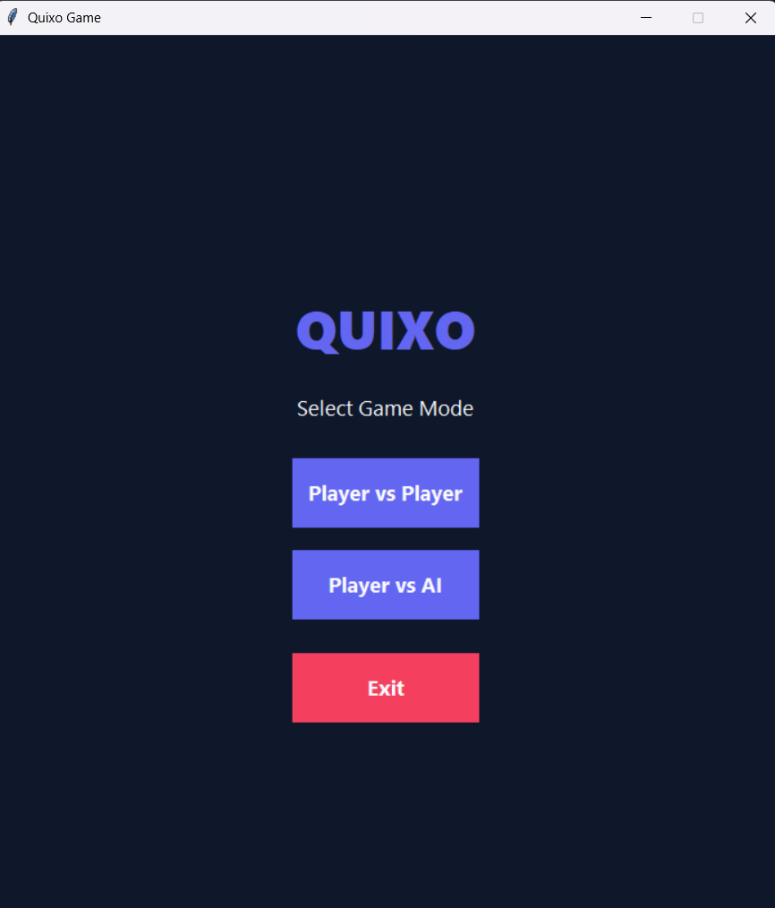
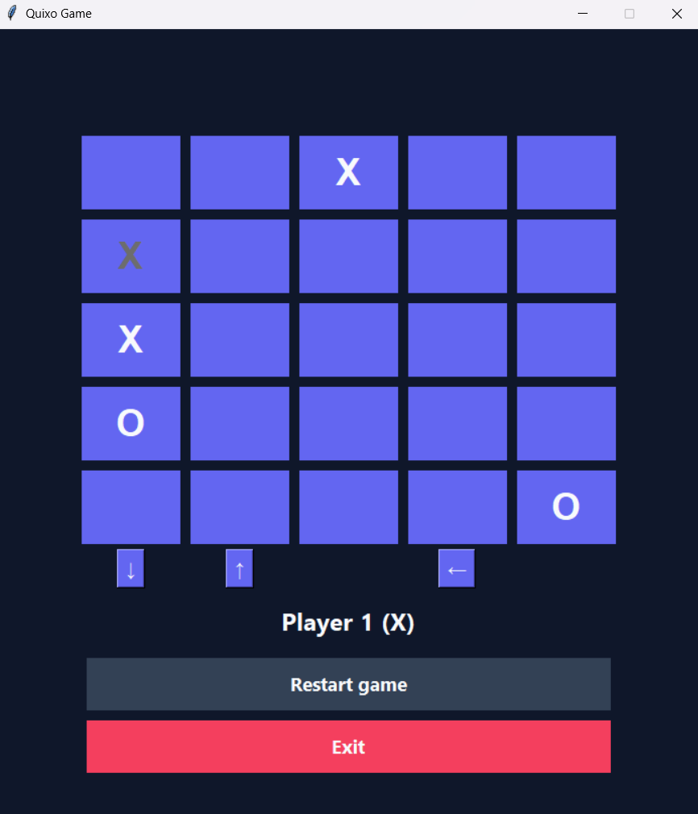

# Quixo Game

Une implémentation en Python du célèbre jeu de plateau abstrait **Quixo**. Ce projet propose une interface utilisateur graphique moderne développée avec `tkinter` et permet de jouer soit contre un autre joueur humain (en local), soit contre une Intelligence Artificielle (IA).

---

## 📸 Aperçu du Jeu

### Menu Principal


### En cours de partie


---

## 📜 Règles du Jeu (Quixo)

Le jeu se déroule sur un plateau de 5x5 cases, avec 25 cubes initialement vierges. 
Deux joueurs s'affrontent : l'un joue les croix (**X**) et l'autre joue les ronds (**O**).

**Le but du jeu :** Être le premier joueur à aligner 5 cubes à sa marque, que ce soit horizontalement, verticalement ou en diagonale.

**Déroulement d'un tour :**
1. **Piocher un cube** : Le joueur doit choisir et "extraire" un cube situé uniquement sur le *pourtour* (bordure) du plateau de jeu. Ce cube doit être soit vierge, soit porter déjà sa propre marque ("X" ou "O"). Il est interdit de prendre un cube portant la marque de l'adversaire.
2. **Placer un cube** : Le joueur doit ensuite replacer ce cube à l'une des extrémités de la rangée (ou colonne) où le trou a été créé, ce qui a pour effet de faire glisser tous les cubes de la rangée d'un cran.
   - Les flèches à l'écran vous indiquent dans quelles directions l'insertion est possible en fonction du cube que vous avez extrait.

**L'Intelligence Artificielle :**
Si vous jouez en solo, l'IA utilise l'algorithme performant **Minimax avec élagage Alpha-Beta** pour anticiper vos coups et déterminer la meilleure stratégie.

---

## 🏗️ Architecture et Design Patterns

Le code de ce projet a été construit de manière robuste en s'appuyant sur des design patterns reconnus :

*   **Modèle-Vue-Contrôleur (MVC)** : Le code est strictement séparé entre la logique pure du jeu (`Jeu`, `Plateau`), l'interface graphique (`VueJeu`), et l'intermédiaire qui gère les clics (`ControllerJeu`).
*   **State (État)** : La gestion des tours (tour normal vs écran de victoire vs écran de match nul) est dictée par ce pattern (fichier `GameState`), évitant ainsi une structure conditionnelle trop lourde.
*   **Factory (Fabrique)** : Utile pour l'instanciation des différentes variantes de cubes (`PionX`, `PionO`, `PionVide`) via la `PionFactory`.
*   **Prototype (Clonage)** : Toutes les entités modèles possèdent une méthode `.clone()`, primordiale pour permettre à l'IA d'effectuer des "deep copies" du plateau afin de simuler des chemins dans son arbre de recherche Minimax.

---

## 🛠️ Installation et Exécution

Ce projet est conçu pour être simple à utiliser et ne nécessite **aucune dépendance externe**. Il utilise uniquement les bibliothèques standards fournies avec Python.

### Prérequis
*   Avoir [Python 3.x](https://www.python.org/downloads/) d'installé sur votre machine.

### Étapes
1. Clonez ce dépôt ou téléchargez les fichiers compressés.
2. Ouvrez un terminal (ou l'invite de commande) dans le dossier du projet :
   ```bash
   cd chemin/vers/Quixo-Game
   ```
3. *(Optionnel)* Un fichier `requirements.txt` est inclus pour respecter les standards de projets, mais il n'est pas nécessaire de lancer de commande `pip install` sur ce projet.
4. Lancez le jeu via la commande suivante :
   ```bash
   python main.py
   ```

Amusez-vous bien !
